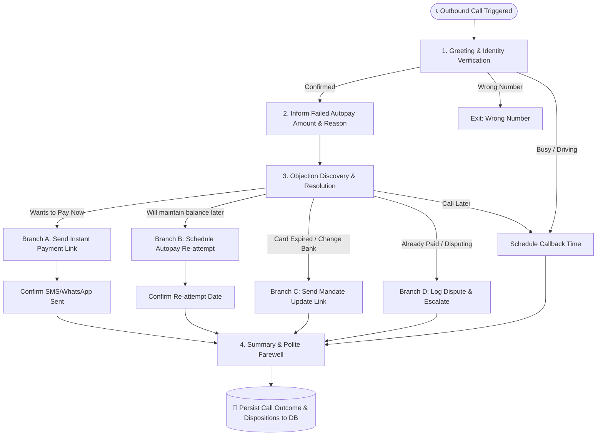

# 📞 Autopay Recovery Voice Agent

[](https://www.python.org/)
[](https://fastapi.tiangolo.com/)
[](https://github.com/langchain-ai/langgraph)
[](https://groq.com/)
[](https://www.sarvam.ai/)
[](https://exotel.com/)

An enterprise-grade **AI Voice Agent system** engineered to autonomously recover failed recurring autopay payments (subscriptions, loan EMIs, utility bills, and insurance premiums). Built on **LangGraph**, **Groq LPU / Gemini**, **Sarvam AI (STT/TTS)**, **Exotel Telephony**, and **FastAPI**.

---

## 📌 Problem Statement & Use Case

The goal of this assignment is to build an AI-powered voice agent that proactively contacts customers after an autopay failure, understands the reason for the failure, communicates with the customer, and attempts to recover the payment through the appropriate next action.

Traditional automated SMS reminders have low conversion rates, and manual call centers are expensive and slow to scale.

### 💡 The Solution
This AI Voice Agent:
1. Proactively calls customers when an autopay transaction fails.
2. Clearly explains the failed amount, billing service, and failure reason.
3. Understands customer intent and objections in real-time (English, Hindi, and Hinglish).
4. Executes dynamic resolution paths:
   * **Instant Payment**: Sends a secure SMS/WhatsApp payment link while on the call.
   * **Autopay Retry Scheduling**: Agrees on a future date to re-trigger the debit.
   * **Mandate Update**: Sends links to update expired cards or switch bank mandates.
   * **Smart Rescheduling**: Notes customer callback times when busy or driving.
   * **Dispute & Cancellation Handling**: Records disputes for 24-hour verification.

---

## 🏗️ Architecture & Conversation Flow



## 🛠️ Tech Stack

| Category | Technologies |
|---|---|
| **Backend** | FastAPI, Uvicorn, Python 3.10+ |
| **Conversational AI & Graph** | LangGraph, LangChain Core |
| **Reasoning LLM** | Groq LPU (`openai/gpt-oss-120b`), Google Gemini 2.5 Flash |
| **Speech-to-Text / Text-to-Speech** | Sarvam AI — Saarika (STT), Bulbul (TTS) |
| **Telephony & Audio Streaming** | Exotel WebSocket Voicebot, ExoML, 8kHz 16-bit PCM streaming, VAD |
| **Database & ORM** | MySQL, SQLite (fallback), SQLAlchemy |
| **Data Processing** | Pandas, OpenPyXL, Dateparser |


🚀 Getting Started
1. Prerequisites
Python 3.10 or higher
(Optional) MySQL server (defaults to local SQLite if MySQL credentials are not provided)
(Optional) Exotel account for telephony testing
## 🚀 Installation

### 1. Clone the repository

```bash
git clone https://github.com/your-username/razorpay-autopay-voice-agent.git
cd razorpay-autopay-voice-agent
```

### 2. Create and activate a virtual environment

**Windows:**

```bash
python -m venv .venv
.\.venv\Scripts\activate
```

**Linux / macOS:**

```bash
python -m venv .venv
source .venv/bin/activate
```

### 3. Install dependencies

```bash
pip install -r requirements.txt
```

## 4.🔐 Environment Configuration

Create a `.env` file in the root directory of the project:

```env
# Reasoning LLMs
GROQ_API_KEY="your_groq_api_key"
GEMINI_API_KEY="your_gemini_api_key"

# Indic STT / TTS — Sarvam AI
SARVAM_API_KEY="your_sarvam_api_key"
SARVAM_STT_URL="https://api.sarvam.ai/speech-to-text"
SARVAM_TTS_URL="https://api.sarvam.ai/text-to-speech"

# Exotel Telephony
# Optional — required only for real outbound calls
EXOTEL_ACCOUNT_SID="your_exotel_sid"
EXOTEL_API_KEY="your_exotel_api_key"
EXOTEL_API_TOKEN="your_exotel_api_token"
EXOTEL_EXOPHONE="your_exophone_number"
EXOTEL_APP_ID="your_app_id"

# Database Configuration
# Optional — defaults to SQLite (voice_agent.db)
MYSQL_USER="root"
MYSQL_PASSWORD="your_password"
MYSQL_HOST="127.0.0.1"
MYSQL_PORT="3306"
MYSQL_DATABASE="voice_agent"
```

### ⚠️ Security Note

Never commit your `.env` file or expose API keys in the repository. Add the following to `.gitignore`:

```gitignore
.env
.venv/
__pycache__/
*.pyc
```

The application can use **SQLite as the default database**, while MySQL can be configured through the environment variables above.

## ▶️ Start the Server

From the project root, start the FastAPI server:

```bash
python -m uvicorn main:app --reload --port 8000
```

## 🖥️ Web Dashboard & Live Simulator

Once the server is running, open the following URLs in your browser:

- **Interactive Dashboard & Simulator:** `http://localhost:8000/dashboard`
- **Interactive Swagger API Docs:** `http://localhost:8000/docs`
- **ReDoc API Documentation:** `http://localhost:8000/redoc`

### Dashboard Features

- **Live Metrics:** View total recoverable dues, pending cases, and successful recovery dispositions.
- **Customer Records:** Filter customer cases by status and view due amounts, failure reasons, and payment links.
- **Voice Agent Simulator:** Test customer conversations directly from the browser with real-time intent extraction and sentiment analysis, without placing an actual phone call.

## 📡 API Reference

| Method | Endpoint | Description |
|---|---|---|
| `GET` | `/dashboard` | Interactive web dashboard and voice-agent simulator |
| `GET` | `/api/cases` | List autopay customer records and their statuses |
| `GET` | `/api/cases/{case_id}` | Get detailed case history and call attempt logs |
| `POST` | `/api/seed-data` | Seed fictional customer records into the database |
| `POST` | `/api/simulate/chat` | Simulate a conversation turn with the LangGraph agent |
| `POST` | `/api/campaigns/upload` | Upload a new `.xlsx` or `.csv` customer report |
| `POST` | `/calls/initiate/{case_id}` | Initiate a live outbound call through Exotel |
| `GET` | `/campaigns/{id}/report` | Download the completed campaign report |
| `WS` | `/ws/exotel` | Exotel real-time bidirectional WebSocket voice stream |

## 🔒 Security & Best Practices

- **No Hardcoded Credentials:** API keys and credentials are managed through environment variables.
- **Database Fallback:** The application automatically falls back to SQLite for standalone/demo environments when MySQL is unavailable.
- **Pre-generated Greeting Audio:** Greeting audio is synthesized before initiating the call to minimize response latency when the customer answers.
- **Voice Activity Detection (VAD):** Uses silence hysteresis and echo-cancellation safeguards to improve interruption detection and reduce false triggers.
